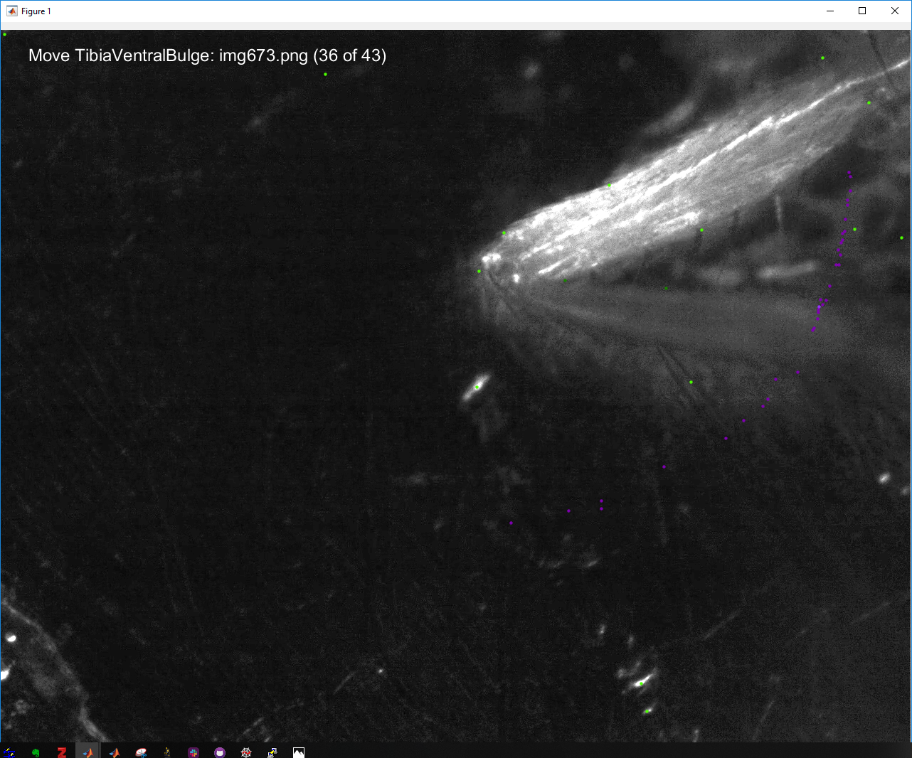
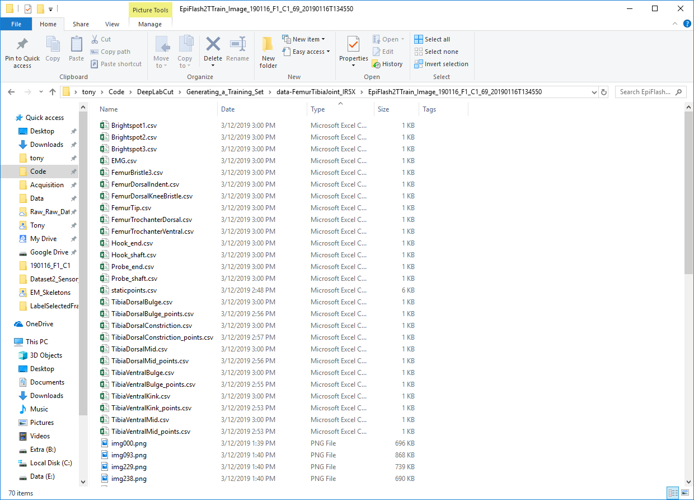
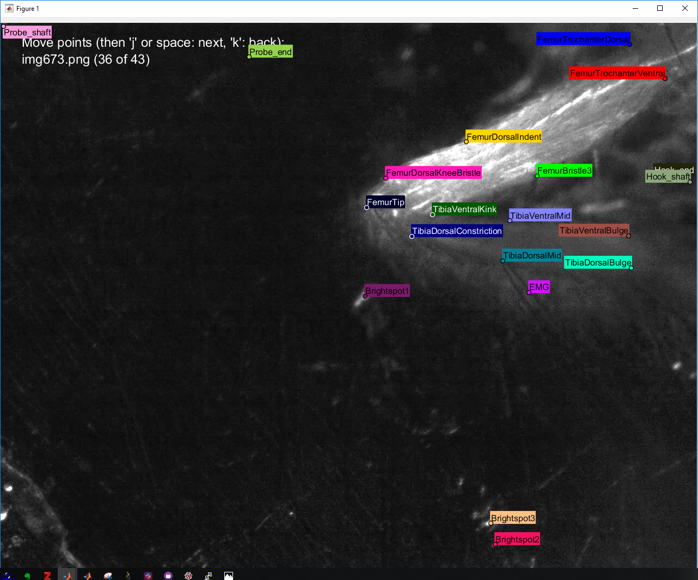

# LabelSelectedFramesForDLC
Simple script to label imgXXX.png images for training sets for DLC

see https://github.com/AlexEMG/DeepLabCut

Currently, generating a training set for DeepLabCut (DLC) requires opening randomly selected frames in FIJI or another editor. This script allows the user to label the random frames in MATLAB and to proofread the labeling. 

**Key functionality**
- label each feature sequentially (i.e. label the feature in each frame, then start at the first frame and label the next feature in each frame)
- label all static features in a single frame without having to click on them repeatedly
- proofread the labeling, drag features to adjust them, with ability to move backward and forward through frames

Update 3/12/19: Since this was written for personal use, a new labeling toolbox has been created for DLC. I have not compared the functionality, feel free to incorporate any ideas or respond with questions.

# Requirements

**Matlab 2018a or later**: Methods_LablelSelectedFramesForDLC.m makes use of matlab "Tables", a data structure similar to DataFrames in pandas or tables in R. The script uses function calls available only in 2018a or later.

**distinguishable_colors**: the proofreading step below relies on plotting points for each feature in different colors that are easy to tell apart. This color map is produced by the matlab function distinguishable_colors(). Download it here: https://www.mathworks.com/matlabcentral/fileexchange/29702-generate-maximally-perceptually-distinct-colors; and put it somewhere on the matlab path.

# Directions:

First, follow directions on the DeepLabCut readme page to run "Step1_SelectRandomFrames_fromVideos.py". This first step will generate directories named according to the videos they come from, and containing selected frames, with filenames "imgXXX.png" where XXX is the frame index (see screenshots below). Note, this script generates .csv files for each body part, so in **myconfig.py** change the **multibodypartsfile** flag to **False**, as in the DLC reaching example.

**Figure:** Directories of selected images from sample movies

**Figure:**  Selected images within directories

# Package Contents
The main labeling script is Methods_LabelSelectedFramesForDLC.m. This script will sequentially open selected images in a single folder associated with a particular movie. 

Additional scripts add a bit of functionality. For directions on their use, see below.

# Before running the script 

**(1) edit the bodyparts variable:** 

(line 8) to include, as a 'cell array', the bodyparts listed in the myconfig.py file, the bodyparts you intend to label.

**(2) which parts will move?** 

(line 10) Most parts (or features) will move from frame to frame, such as legs. Other parts can remain static or move rarely, but they should be labeled so as to avoid mistaking that feature for a target feature during training. Change the movingparts variable to indicate the indices of the moving parts in the bodyparts cell array.

**(3) which parts are static?** 

(line 12) Change the staticparts variable to indicate the indices of the static parts in the bodyparts cell array.

**(4) edit the training set directory:** 

(line 15) to navigate to the correct folder, the directory containing images.

# Run the script

**Label body parts**

The first part of the routine is to label static and moving parts. The functionality is as follows:

- Within the directory of images, open the first image.
  - Label the static parts that won't move from frame to frame. Click on the feature indicated in the top right of the image. 
  - Loop through all images confirming the position of each static feature in each image.
    - If a feature moved a little, drag the dot to the desired location. If a feature dissapeared (obscured or moved off screen, drag that dot to the "invisible location" (see DLC documentation)
    - Once the dots are correctly located, hit the space bar.
  - Label each moving part individually. The user will be alerted when the next feature begins. The user can either
    - Hit the space bar if the feature has not moved. Or,
    - Click on the location of the feature, a magenta dot will appear to indicate the location and the next img will appear.
  

**Figure:** Labeling parts of a fly leg (femur/tibia)

After each feature is labeled, a .csv file is saved with the filename \<bodypart\>_points.csv. The static points are saved to a file "staticpoints.csv". If the labeling routine is interrupted for whatever reason, the script looks for saved "\<bodypart\>_points.csv" files and will skip those features, jumping to features that have not yet been labeled. If you want to relabel features, you can delete the "\<bodypart\>_points.csv" files or change the editing logicals on lines 17, 18, and 19.

Finally, the script saves a file with the naming convention "\<bodypart\>.csv" for each bodypart, both moving and static. These files will be used in the subsequent "Step2_ConvertingLabels2DataFrame.py" routine to create a file "CollectedData_\<Scorer\>.csv" in the parent training set folder.

**Figure:** "\<bodypart\>.csv" files 

**Proofread labeling**

Now the routine will loop back through each directory to proofread the labeling. The functionality is as follows:

- Show the first image.
  - Drag the label locations to the appropriate feature. The locations of each bodypoint/feature has it's own color.
  - Hit the space bar or 'j' once the labels are in the correct locations.
  - Loop through all images confirming the position of all the features in each image.
  - To go backward hit 'k'.
  

**Figure:** Proofreading labeling of a fly leg (femur/tibia)

This routine simply edits all of the bodypart.csv files.

Note: you can rerun the proofreading step anytime from within the folder, just rerun that section of the script (a.k.a that cell).

**Next Steps**

Now you're ready to move on with the rest of the training as described at https://github.com/AlexEMG/DeepLabCut, starting with "Step2_ConvertingLabels2DataFrame.py".

**Happy clicking!**

# Additional Scripts
- Methods_CycleThroughDirectoriesAndApplyScript.m will start at the parent directory and navigate to each movie directory in turn and run Methods_LabelSelectedFramesForDLC.m. 
- If you have labeled a movie in the past and would like to label additional features that don't tend to move but are likely to be falsely identified by DLC, you can use the Methods_AddNewStaticBodyPart.m script to do that. 
- Finally, you might start by labelling e.g. 170 frames of a particular movie but may not want to continue training the network on all of them in the future. In that case, Methods_SelectSubsetOfLabeledFramesForDLC.m with extract a random set of N images (line 12), storing the originals in a subdirectory. 

This code is associated with the paper from Azevedo et al., "A size principle for recruitment of Drosophila leg motor neurons". eLife, 2020. http://doi.org/10.7554/eLife.56754
